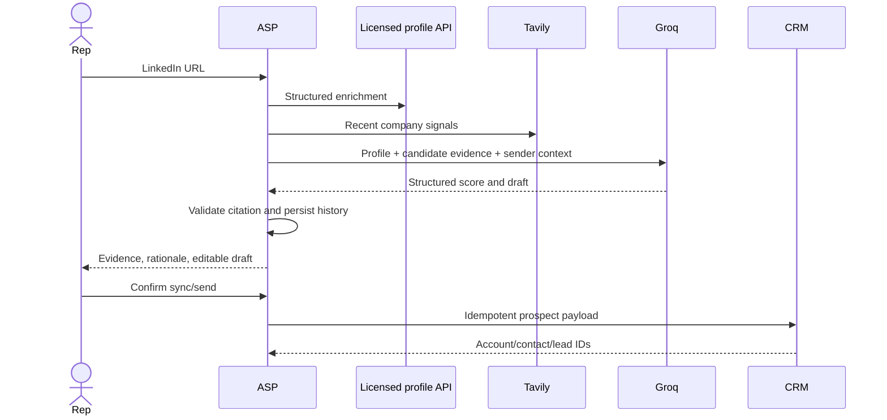

# Prospecting flow

Trust boundaries:

1. Provider output is untrusted and schema-validated.
2. Retrieved text may contain prompt injection; it is evidence, never an instruction.
3. The model proposes content but cannot bypass deterministic validation or confirmation.
4. The CRM shared secret authenticates the service, while `CRM_ORGANIZATION_ID` selects the tenant; both must be protected.

