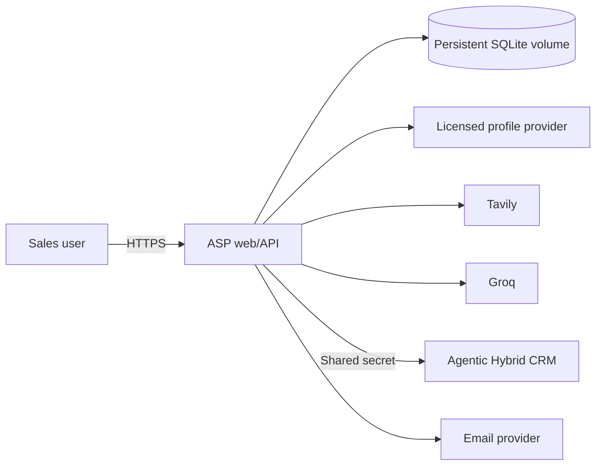

# Production deployment and operations

## Topology

The current persistence layer is SQLite. Production must run a single application replica with an encrypted persistent volume and regular snapshots. Horizontal replicas are unsafe until persistence, rate limits and sessions move to a shared database such as PostgreSQL.

## Release procedure

1. Require CI lint, tests, production build and container build.
2. Snapshot the data volume and verify secret-manager values.
3. Deploy the image by immutable digest to staging.
4. Smoke-test login, research with a test prospect, evidence citations, draft editing and CRM sync.
5. Deploy one production replica, mount `/app/data`, then verify login and a read-only health/smoke request.
6. Monitor 5xx errors, upstream failures, research latency, daily usage, email events and disk capacity.

## Configuration

Copy `.env.example` to the platform secret configuration. Required for the core flow: `GROQ_API_KEY`, `TAVILY_API_KEY`, `PROFILE_API_URL`, `PROFILE_API_KEY`, `APP_URL`, `DATABASE_PATH`. CRM sync additionally requires `CRM_API_URL`, `CRM_ORGANIZATION_ID` and `ASP_SHARED_SECRET`. Email and HubSpot remain disabled when their credentials are empty.

Secrets must never use `NEXT_PUBLIC_`, repository secrets intended for browser builds, image build arguments or log output. Rotate shared secrets on both systems in a coordinated maintenance window.

## Backup and recovery

Snapshot the SQLite database at least daily using a filesystem/database-consistent method, encrypt backups, retain them according to policy and conduct quarterly restore tests. Stop writes or use SQLite's online backup mechanism before copying the database. Document recovery time and recovery point objectives.

## Scaling migration gate

Before more than one ASP replica, migrate users, sessions, prospects, evidence, drafts, usage, rate limits, idempotency and audit data to PostgreSQL; add distributed locking for retention and sequence workers; then execute concurrency and failover tests.

